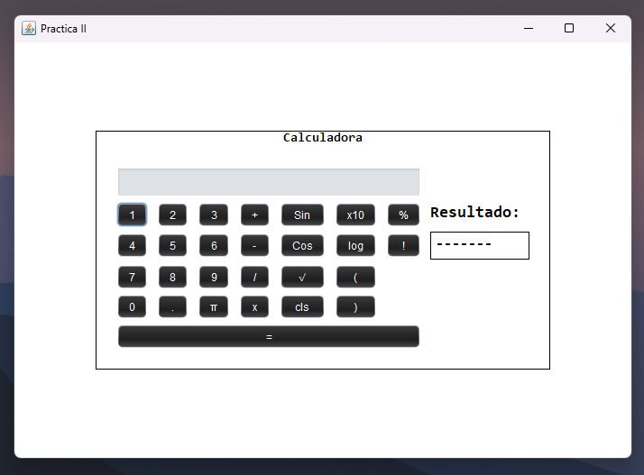
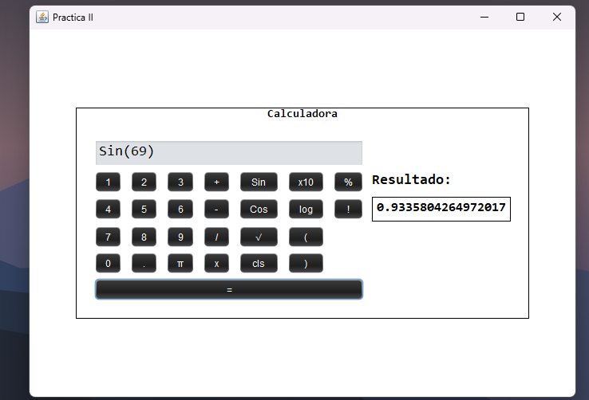
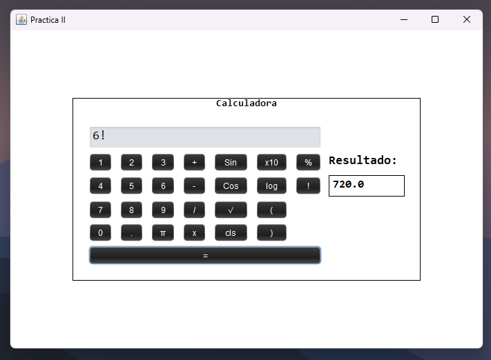
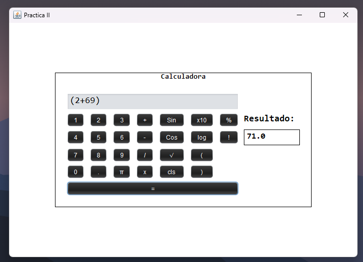

# Calculadora GUI

Esta es una calculadora con una interfaz gráfica de usuario (GUI) desarrollada en Java. La calculadora es capaz de realizar operaciones fundamentales y algunas funciones especiales.

## Características

La calculadora incluye las siguientes características:

### Operaciones fundamentales
- Suma
- Resta
- Multiplicación
- División
### Funciones especiales
- Raíz cuadrada
- Multiplicar por 10^
- Logaritmo natural
- Factorial
- Porcentaje
- Seno
- Coseno
- Valor de PI (π)

## Captura de pantalla

A continuación, se muestra una captura de pantalla de la calculadora en funcionamiento:

